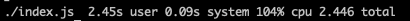

# Lifen exercice

Pour la résolution de l'exercice j'ai utilisé l'algorithme suivant :

- Je parcours le fichier, en réduisant avec un accumulateur
  - Pour chaque line/mot, je compte les occurences de chaque lettre
  - Je remplie ensuite mon objet d'accumulation avec la clef de frequence du mot (la concaténation de chaque lettre et de son nombre d'occurence, classé par ordre alphabétique), en poussant dans le tableau si la clef existe, sinon c'est un nouveau tableau avec le mot
  - Je récupére ensuite les valeurs de mon objet et je filtre sur celle avec plus de deux mots pour avoir les anagrammes

Sur un macbook pro de 2013 j'arrive à 2,45s en nodejs



## Lancer le programme

Le programme peut se lancer de deux manières différentes :

```
$ node index.js
$ ./index.js
```

Il faut au moins nodejs installé sur la machine et préalablement avoir installé les packages avec `yarn` ou `npm i`
